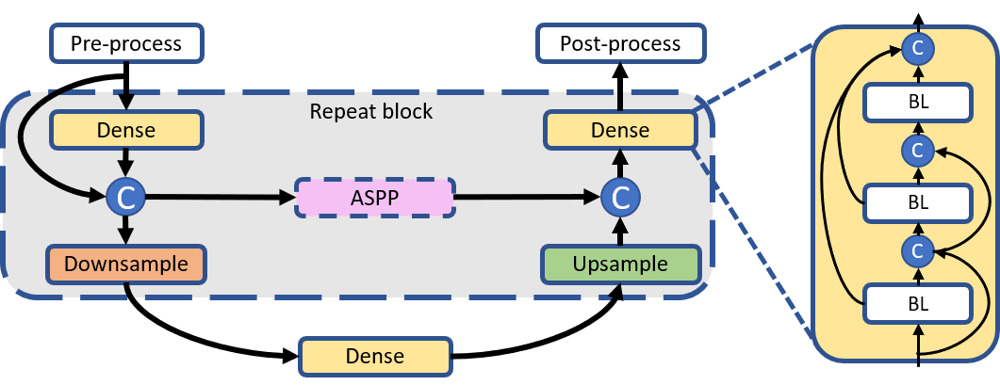

# ComBiNet: Compact Convolutional Bayesian Neural Network for Image Segmentation

by Martin Ferianc (martin.ferianc.19@ucl.ac.uk), Divyansh Manocha, Hongxiang Fan and Miguel Rodrigues

This repository presents **ComBiNets**: light-weight Bayesian convolutional neural networks for image segmentation. They extend a number of ideas from state-of-the-art alternatives and encapsulate them with Bayesian inference through Monte Carlo Dropout. We performed experiments with respect to challenging low-resolution CamVid and Bacteria datasets. This repository is our official PyTorch implementation. 

The paper can be found at: https://arxiv.org/abs/2104.06957 

- [ComBiNet: Compact Convolutional Bayesian Neural Network for Image Segmentation](#combinet-compact-convolutional-bayesian-neural-network-for-image-segmentation)
  - [Abstract](#abstract)
  - [Software implementation](#software-implementation)
  - [Getting the code](#getting-the-code)
  - [Dependencies](#dependencies)
  - [License](#license)
    - [Citation](#citation)
  - [Credits](#credits)



Figure 1.: ComBiNet an U-Net like architecture consisting of Repeat blocks with different input scales and dilation rates in an Atrous Spatial Pyramid Pooling (ASPP) module. The block contains Dense feature extracting blocks, Downsampling to reduce the spatial dimensionality by 2 times and Upsampling for restoring it back after processing the features from a lower dimensionality. The context is transferred through an optional ASPP module and concatenated (C), pairing the same spatial resolution. On the right is the detail of the Dense block consisting of Basic Layers (BLs). The arrows represent data flow.

## Abstract

Fully convolutional U-shaped neural networks have largely been the dominant approach for pixel-wise image segmentation. In this work, we tackle two defects that hinder their deployment in real-world applications: 1) Predictions lack uncertainty quantification that may be crucial to decision making systems; 2) Large memory storage and computational consumption demanding extensive hardware resources. To address these issues and improve their practicality we demonstrate a few-parameter compact Bayesian convolutional architecture, that achieves a marginal improvement in accuracy in comparison to related work using significantly fewer parameters and compute operations. The architecture combines parameter-efficient operations such as separable convolutions, bi-linear interpolation, multi-scale feature propagation and Bayesian inference for per-pixel uncertainty quantification through Monte Carlo Dropout. The best performing configurations required less than 2.5 million parameters on diverse challenging datasets with few observations.

## Software implementation

All source code used to generate the results for ComBiNets presented in the paper is in the `combinet` folder.

The calculations are all run with Python 3.8>= through the scripts in the `combinet/experiments` folder.

The data used in this study should be downloaded from https://github.com/alexgkendall/SegNet-Tutorial/tree/master/CamVid and https://www.kaggle.com/longnguyen2306/bacteria-detection-with-darkfield-microscopy and placed under `combinet/data` with the same structure as seen in the link (CamVid). For pre-processing the bacteria dataset we provide a script `combinet/data/preprocess_bacteria.py`, it splits the data into training, test and validation and infers the necessary constants. 

To run the best pretrained models for both datasets (combinetL for CamVid and combinetM for Bacteria):
```bash
# --gpu flag to select the GPU index for acceleration
# --visualise flag to enable visualisation during traning and evaluation
# Inside for example `combinet/experiments/camvid/`
python3 runner.py --gpu 0 --model combinetL --load ./combinetL/weights_799.pt --visualise

# Inside for example `combinet/experiments/bacteria/`
python3 runner.py --gpu 0 --model combinetM --load ./combinetM/weights_799.pt --visualise

# To check that all looks good with the datasets you can also run
# You should find the desired Figures under figs/
# Inside  `combinet/experiments/`
python3 visualize_data.py --dataset bacteria
```

## Getting the code

You can download a copy of all the files in this repository by cloning the [git](https://git-scm.com/) repository:

    git clone https://github.com/martinferianc/ComBiNet.git

## Dependencies

You will need a working Python environment to run the code.

The recommended way to set up your environment is through the virtual environment and the `requirements.txt` which we provide in the root of the repository. 

```
python3 -m venv /path/to/new/virtual/environment
source /path/to/new/virtual/environment/bin/activate
pip3 install -r requirements.txt
```

## License

All source code is made available under a BSD 3-clause license. You can freely use and modify the code, without warranty, so long as you provide attribution to the authors. See LICENSE.md for the full license text.

The manuscript text is not open source. The authors reserve the rights to the article content. If you use ideas presented in this work please cite our work:

### Citation

```
@misc{ferianc2021combinet,
      title={ComBiNet: Compact Convolutional Bayesian Neural Network for Image Segmentation}, 
      author={Martin Ferianc and Divyansh Manocha and Hongxiang Fan and Miguel Rodrigues},
      year={2021},
      eprint={2104.06957},
      archivePrefix={arXiv},
      primaryClass={cs.CV}
}
```
## Credits

- Metric implementation, ASPP implementation: https://github.com/VainF/DeepLabV3Plus-Pytorch

- Code skeleton for the architecture: https://github.com/bfortuner/pytorch_tiramisu

- Datasets: https://github.com/alexgkendall/SegNet-Tutorial/tree/master/CamVid, https://www.kaggle.com/longnguyen2306/bacteria-detection-with-darkfield-microscopy
  
- README template: https://github.com/pinga-lab/paper-template/blob/master/README.md

- MAC counts: https://github.com/sovrasov/flops-counter.pytorch

- Dice Loss: https://github.com/hubutui/DiceLoss-PyTorch

We additionally thank ICANN 2021 reviewers for insightful comments.
